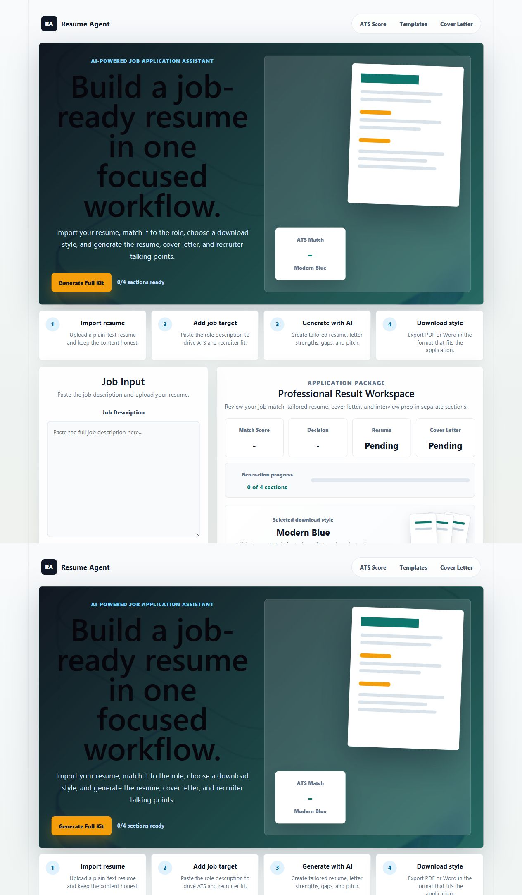
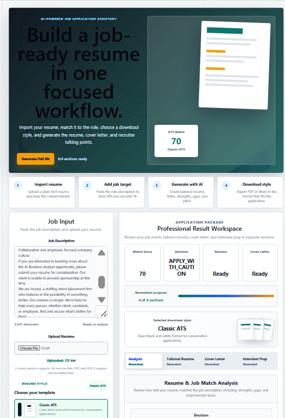
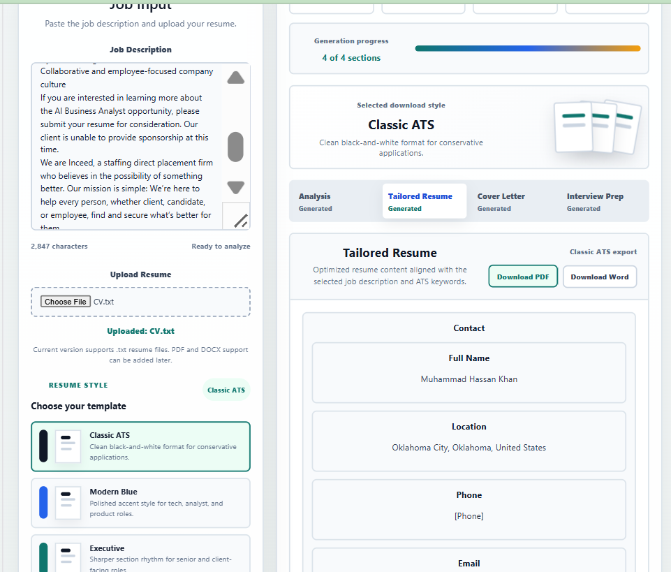
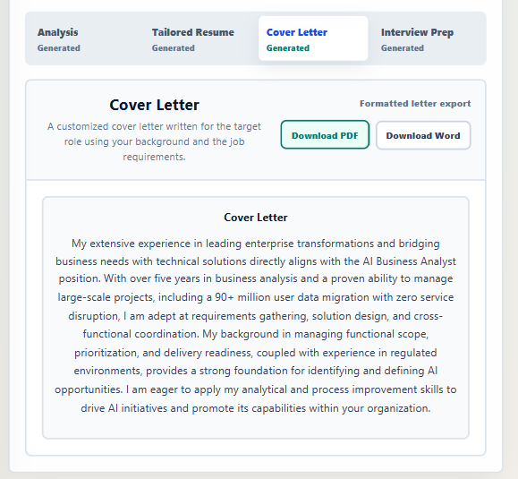
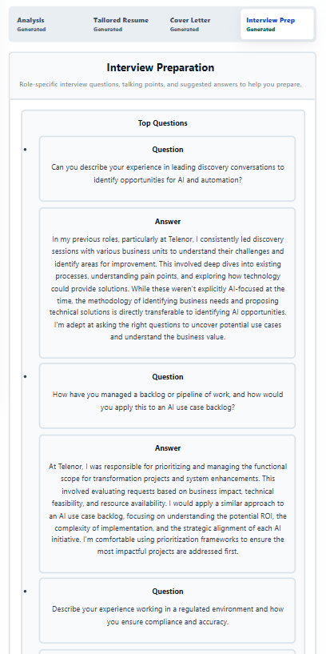

# AI Job Application Assistant

A full-stack AI-powered job application assistant that helps job seekers analyze job descriptions, evaluate resume fit, and generate tailored ATS-style resume content, cover letters, and interview preparation guidance.

The application uses a React/Vite frontend, Node.js/Express backend, and Google Gemini API to provide job-fit analysis, application recommendations, resume tailoring, and career preparation support.

---

## Live Demo

**Frontend:**  
https://hassan2163.github.io/AI-Job-Application-Assistant/

**Backend:**  
Hosted on Render

---

## Screenshots

### Home / Landing Page



### Job Description Analysis



### Tailored Resume Output



### Cover Letter Output



### Interview Preparation Output



---

## Features

- Analyze job descriptions against a candidate profile or resume
- Generate job match score and fit analysis
- Provide Apply / Apply with Caution / Skip recommendations
- Generate ATS-style tailored resume content
- Create concise cover letters
- Generate interview preparation guidance
- Identify strengths, gaps, and transferable skills
- Export generated content to PDF or DOCX
- Secure Gemini API integration through backend
- Deployed frontend using GitHub Pages
- Deployed backend using Render

---

## Tech Stack

### Frontend

- React
- Vite
- JavaScript
- HTML/CSS
- GitHub Pages

### Backend

- Node.js
- Express.js
- Google Gemini API
- Render

### Other Tools

- GitHub Actions
- CORS
- Helmet
- Rate limiting
- File upload handling
- PDF/DOCX export

---

## Project Structure

```txt
AI-Job-Application-Assistant/
|
|-- frontend/
|   |-- src/
|   |-- public/
|   |-- package.json
|   |-- vite.config.js
|   `-- .env.production
|
|-- Backend/
|   |-- app.js
|   |-- package.json
|   |-- .env.example
|   `-- other backend files
|
|-- screenshots/
|   |-- home-page.png
|   |-- job-analysis.png
|   |-- ai-output.png
|   `-- interview-prep.png
|
|-- .github/
|   `-- workflows/
|
|-- .gitignore
|-- render.yaml
`-- README.md
```

---

## How It Works

1. User enters or uploads resume/profile information.
2. User pastes a target job description.
3. Frontend sends the request to the Express backend.
4. Backend securely calls the Gemini API.
5. Gemini analyzes the resume against the job description.
6. The app returns:
   - Match score
   - Application recommendation
   - Resume improvement suggestions
   - Tailored resume content
   - Cover letter
   - Interview preparation guidance

---

## AI Output Focus

The assistant is designed to generate practical and honest job application guidance. It focuses on:

- Matching real resume experience with job requirements
- Highlighting direct and transferable skills
- Identifying missing or weak areas
- Avoiding fabricated experience, fake tools, or false metrics
- Creating ATS-friendly language
- Helping users decide whether a job is worth applying to

---

## Environment Variables

Create a `.env.example` file inside the `Backend/` folder:

```env
GEMINI_API_KEY=your_gemini_api_key_here
FRONTEND_URL=https://hassan2163.github.io
PORT=5000
```

For local development, create a real `.env` file inside the `Backend/` folder and add your actual Gemini API key.

Do not commit the real `.env` file to GitHub.

---

## Frontend Environment Setup

For production, create a `.env.production` file inside the `frontend/` folder:

```env
VITE_API_URL=https://your-render-backend-url.onrender.com
```

Example:

```env
VITE_API_URL=https://ai-job-application-assistant.onrender.com
```

---

## Local Development

### 1. Clone the repository

```bash
git clone https://github.com/hassan2163/AI-Job-Application-Assistant.git
cd AI-Job-Application-Assistant
```

### 2. Run the backend

```bash
cd Backend
npm install
npm start
```

The backend should run locally on:

```txt
http://localhost:5000
```

### 3. Run the frontend

Open a new terminal:

```bash
cd frontend
npm install
npm run dev
```

The frontend should run locally on:

```txt
http://localhost:5173
```

---

## Deployment

### Frontend Deployment

The frontend is deployed using GitHub Pages.

Production frontend URL:

```txt
https://hassan2163.github.io/AI-Job-Application-Assistant/
```

### Backend Deployment

The backend is deployed on Render as a web service.

Render configuration:

```txt
Root Directory: Backend
Build Command: npm install
Start Command: npm start
```

Required Render environment variables:

```env
GEMINI_API_KEY=your_real_gemini_api_key
FRONTEND_URL=https://hassan2163.github.io
```

---

## Security Notes

- Gemini API key is stored only on the backend.
- Frontend does not expose secret keys.
- Backend includes CORS configuration.
- Backend uses rate limiting to reduce abuse.
- Uploaded resume files are validated.
- `.env` files are excluded from GitHub.
- Production environment variables are managed through Render.

---

## Future Improvements

- Add user authentication
- Save job application history
- Add multiple resume profiles
- Add advanced resume templates
- Add LinkedIn message generator
- Add recruiter outreach email generator
- Add application tracker dashboard
- Add Stripe payment integration
- Add premium plan support
- Add mobile/PWA support

---

## Purpose of the Project

This project was built as a practical AI-powered career assistant and portfolio project. It demonstrates full-stack development, AI API integration, frontend/backend deployment, prompt engineering, environment variable security, and product thinking around job search automation.

The project also reflects a real-world use case: helping job seekers evaluate opportunities, tailor their applications, and prepare more confidently for the hiring process.

---

## Author

Muhammad Hassan Khan

**GitHub:**  
https://github.com/hassan2163

**Live Project:**  
https://hassan2163.github.io/AI-Job-Application-Assistant/
